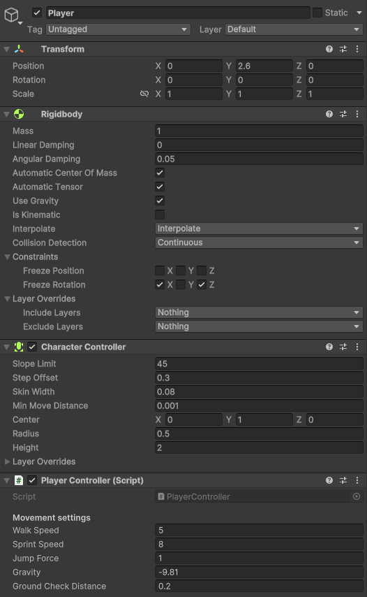

# Third Person Controller
First add a Cinemachine Free Look camera to the main camera.

## Player setup
Setup the player object like this:


## Player controller script
```C#
using UnityEngine;

public class PlayerController : MonoBehaviour
{
    [Header("Movement settings")]
    [SerializeField] private float walkSpeed = 5f;
    [SerializeField] private float sprintSpeed = 8f;
    [SerializeField] private float jumpForce = 1f;
    [SerializeField] private float gravity = -9.81f;
    [SerializeField] private float groundCheckDistance = 0.2f;

    private CharacterController characterController;
    private Vector3 velocity;

    // Start is called once before the first execution of Update after the MonoBehaviour is created
    void Start()
    {
        characterController = GetComponent<CharacterController>();

        Cursor.lockState = CursorLockMode.Locked;
        Cursor.visible = false;
    }

    // Update is called once per frame
    void Update()
    {
        HandleMovement();
    }

    void HandleMovement() {
        bool isGrounded = IsGrounded();
        if (isGrounded && velocity.y < 0) {
            velocity.y = -2f;
        }

        float horizontal = Input.GetAxisRaw("Horizontal");
        float vertical = Input.GetAxisRaw("Vertical");

        Vector3 moveDirection = Camera.main.transform.right * horizontal + Camera.main.transform.forward * vertical;
        moveDirection = Vector3.ClampMagnitude(moveDirection, 1.0f);

        float moveSpeed = Input.GetKey(KeyCode.LeftShift) ? sprintSpeed : walkSpeed;
        characterController.Move(moveDirection * moveSpeed * Time.deltaTime);

        if (Input.GetButtonDown("Jump") && isGrounded) {
            velocity.y = Mathf.Sqrt(jumpForce * -2f * gravity);
        }

        velocity.y += gravity * Time.deltaTime;
        characterController.Move(velocity * Time.deltaTime);

        
        Vector3 camForward = Camera.main.transform.forward;
        camForward.y = 0;
        transform.rotation = Quaternion.Lerp(transform.rotation, Quaternion.LookRotation(camForward, Vector3.up), 0.1f);
    }

    private bool IsGrounded() {
        return Physics.Raycast(transform.position + Vector3.up * 0.03f, Vector3.down, groundCheckDistance);
    }
}

```