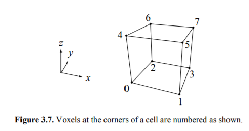
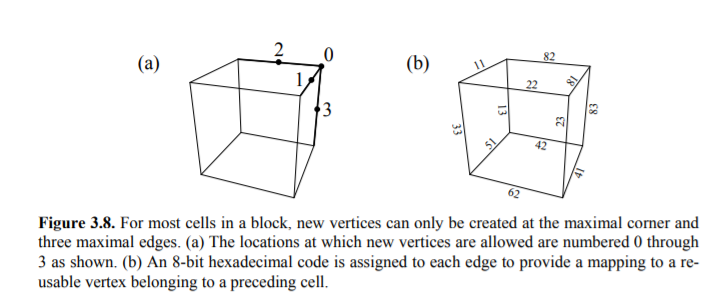

# Transvoxel
The Transvoxel Algorithm is a method for seamlessly stitching together neighboring triangle meshes generated from voxel data at differing resolutions so that level of detail (LOD) can be used with large voxel-based datasets such as volumetric terrain in next-generation video games. ([transvoxel.org](transvoxel.org))

## The problem
To have a terrain large enough for user experience while maintaining performance, different resolutions of meshes should be used. However, stiching together meshes generated with different resolutions can result in holes

## Voxel Data
Voxel data is assumed to be an integer in [-127, 127]. Negative numbers represent voxel that are in solid space, and positive numbers means that the voxel is in empty space.

## Modified marching cubes
- Like the original marching cubes algorithm, the modified marching cubes algorithm loop through every 2x2 voxel (a cell) and generate triangles
- The corners of a cube is labeled the same way as the original marching cubes

- Computing the case code is also the same as the original
```
casecode = 0
foreach corners with index i
    if the voxel at corner i is in solid space
        set the ith bit of casecode to 1
```
- Unlike the original marching cubes algorithm, new vertices can only be created on the edges that touches corner 7

- An edge is labeled with an 8 bit code. If the higher nibble is 8, then it is fine to create a new vertex on the edge. Otherwise, share vertices with nearby cells. The bit values 1, 2, and 4 indicate we must subtract 1 from x, y, and z respectively. The lower nibble indicates which edge (0, 1, 2, or 3, shown in the left) the new vertex should be created on (or to be shared with).
    - For example, if a vertex is to be created on the edge with edge code 62 (0110 0010), then it should share the vertex located on edge 2 of the cell with offset (x = 0, y = -1, z = -1)
    - In the `regularVertexData` table, the edge code is appended with another byte containing information on the edge. For example, `0x2315` represent the edge with edge code `0x23`, connecting from corner `1` to corner `5`
- If a cell is located on the boundary, then the above restriction no longer applies and a new vertex can be created on an edge that does not have an edge code that starts with 8
- To generate a new vertex on an edge, interpolate between the two corners connecting the edge using this equation<br>
,<br>
where<br>

    - P<sub>0</sub>: Position of the corner with a lower index
    - P<sub>1</sub>: Position of the corner with a higher index
    - d<sub>0</sub>: Voxel value of the corner with a lower index
    - d<sub>1</sub>: Voxel value of the corner with a higher index
